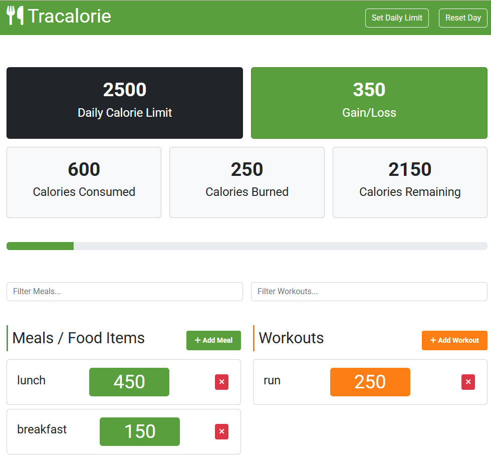

# 🥗 Calorie Tracker App

A modern, object-oriented JavaScript application for tracking daily calorie intake and burn.  
This refactored version is built with a clean class-based architecture, modularized into separate components, and bundled using **Webpack** for better scalability and maintainability.  
The app allows users to log meals and workouts, set a daily calorie limit, and track progress in real time all with data persistence via `localStorage`.

---

## 🔍 Live Preview

You can access the live version of the app here:  
[🌐 Visit the Calorie Tracker Website](https://tracalorie-4nek.onrender.com)

---

## 📦 Features

- ✅ Add meals with calorie values
- ✅ Add workouts with calorie burn values
- ✅ Real-time calorie tracking (consumed, burned, remaining)
- ✅ Set a daily calorie limit using a modal form
- ✅ Search and filter meals or workouts
- ✅ Delete individual items
- ✅ Reset all data with a single click
- ✅ Persistent data using `localStorage`

---

## 🧱 Tech Stack

- HTML5
- CSS3 (with Bootstrap 5)
- Vanilla JavaScript (ES6)
- `localStorage` for persistence

---

## 🧠 Project Structure (OOP-Based)

---

